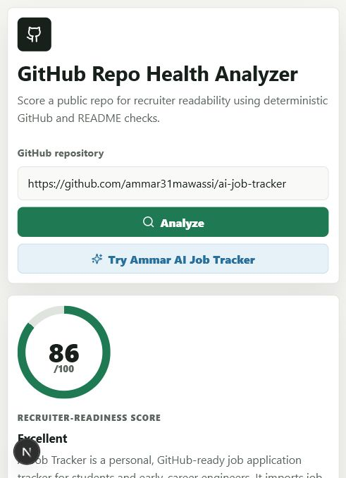

# GitHub Repo Health Analyzer

GitHub Repo Health Analyzer is a small Next.js app that checks whether public GitHub work is recruiter-readable. It accepts a repo URL, `owner/repo`, or a GitHub account name, fetches public GitHub signals, and returns explainable repo scores with strengths, gaps, improvement suggestions, a resume bullet draft, and a short LinkedIn summary draft.

## Why It Is Useful

Students often have real project work on GitHub, but recruiters need to understand it quickly. This tool focuses on the signals a reviewer can see in a few minutes:

- Clear README explanation
- Setup and usage instructions
- Screenshots or demo links
- Visible tests and quality signals
- Detectable tech stack
- Recent activity
- Repository structure and metadata

The scoring is deterministic first. Optional AI suggestions can be enabled with an API key, but the demo works without secrets.

## Tech Stack

- Next.js App Router
- TypeScript
- React
- GitHub public REST API
- Vitest for focused unit tests
- GitHub Actions for CI

## Setup

```bash
npm install
npm run dev
```

Open [http://localhost:3000](http://localhost:3000).

## Environment Variables

Copy `.env.example` to `.env` if you want optional integrations:

```bash
GITHUB_TOKEN=
OPENAI_API_KEY=
OPENAI_MODEL=gpt-4.1-mini
```

- `GITHUB_TOKEN` is optional and only raises local GitHub API rate limits.
- `OPENAI_API_KEY` is optional. If set, the app sends only the deterministic public-repo summary to OpenAI for three extra suggestions.
- No secret is required for the basic demo.

## Example Repo To Test

Use Ammar's AI Job Tracker:

```text
https://github.com/ammar31mawassi/ai-job-tracker
```

You can also try any public repo in `owner/repo` format.

To score every public repo in an account, enter a username or profile URL:

```text
ammar31mawassi
https://github.com/ammar31mawassi
```

Then click **Analyze GitHub Account**.

## Scoring Model

The analyzer gives up to 100 points:

- Repository metadata: 10
- README clarity: 20
- Setup and usage: 15
- Screenshots and demo proof: 10
- Tests and quality signals: 15
- Tech stack detectability: 10
- Recent activity: 10
- Repository structure: 10

Each score section includes evidence so the report is explainable instead of hidden behind AI.

## Tests

```bash
npm test
```

The current tests cover:

- GitHub URL and shorthand parsing
- README signal detection
- Recruiter-readiness scoring behavior
- Account-wide aggregation behavior
- A self-readiness check that keeps this project at 90+ under its own scoring model

## Architecture

See [docs/architecture.md](docs/architecture.md) for the data flow, API boundaries, and MVP tradeoffs.

## Screenshots

Current local report screenshot:



Before publishing, consider capturing:

1. A full report for `ammar31mawassi/ai-job-tracker`
2. A close-up of the score and deterministic scoring sections
3. The generated resume and LinkedIn draft section

Place the final screenshots in `docs/` and keep the best one near the top of this README.

## Build Checks

```bash
npm run lint
npm test
npm run build
```

## MVP Boundaries

- Public GitHub repositories only
- Account mode analyzes public repositories only
- No login or database
- No private repository access
- No required AI key
- No dashboards, teams, or payments
